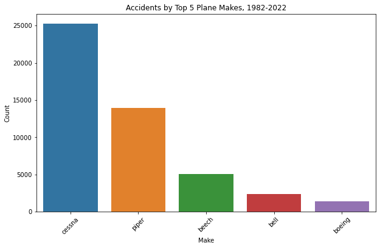
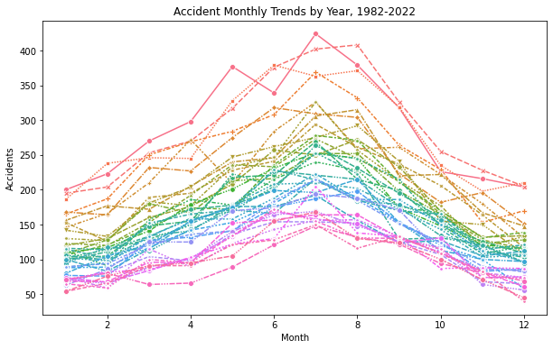
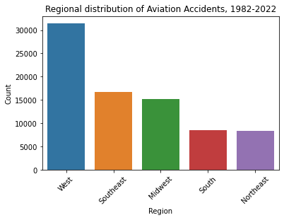

# Phase 1 Project Description

## Project Overview

For this project, I used data cleaning, imputation, analysis, and visualization to generate insights for MTP (Move That Plane), Inc.'s logistics department.

### Business Problem

MTP specialized in the logistics of aircraft transportation and storage. They are looking for which companies to set up partnerships with, in order to streamline their transportation channels and ensure the aircraft get delivered to the right locations at the right time. In addition, they are looking to optimize the location of their warehouses (hangars) that store the aircraft, and minimize time that product (the aircraft) sit in the warehouses (hangars).

### The Data

In the `data` folder is a [dataset](https://www.kaggle.com/datasets/khsamaha/aviation-accident-database-synopses) from the National Transportation Safety Board that includes aviation accident data from 1962 to 2022 about civil aviation accidents and selected incidents in the United States and international waters.

For this analysis, we filtered on accidents occurring in the United States, and given the lack of data from 1962 to 1981, focused on the timeframe between 1982 - 2022.

Data was cleaned to yield the best grouping of the data by the following:
- Time series (Month, Year)
- `Make`, which is the companies MTP will be partnering with
- `Model`, or the products provided by the above `Make` companies
- `Location` to determine groupings of crashes throughout the United States

the data was saved as follows:
- Location: given the long run-time of location data, a separate file was saved under the data folder as `test_geodata2.csv`
- the rest of the data was saved as `data_cleaned.csv`

## Results

Based on the data analysis, we recommend MTP follow the below guidelines:

* MTP will focus on a business relationship with 5 companies: Cessna, Bell, Beechcraft (under the umbrella Textron Corporation), Piper, and Boeing

* Within the 5 companies, the top 5 models have been listed for distribution

* timing-wise, it is best to stock the warehouses before the busiest months, which appear to be between May - August

* MTP will have regional outposts divvied up by Northeast, Southeast, South, Midwest, and West divisions, which will focus on the above 5 companies based off top makes by each region, with Cessna being the frontrunner across all regions

### Next Steps

In order to further improve location of MTP warehouses, clustering methodology will be performed on crash data to determine hotspots within each region that will require quick turnaround of replacement aircraft.

In addition, given the cleaned geographic coordinates of crash sites, it is possible to calculate the distance between takeoff airport and crash site. this will give insight to optimal insurance coverage plans on aircrafts, as well as forecast future possibilities of retrieving damaged aircraft for repair & re-use.

### Tableau Dashboard

https://public.tableau.com/app/profile/reid.majka/viz/Phase-1-project/Dashboard1?publish=yes
